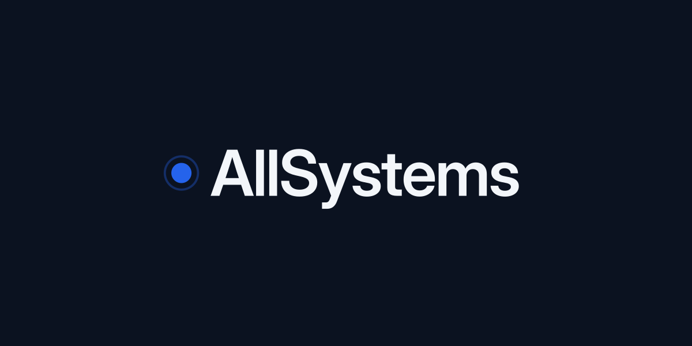

<h1 align="center">laravel</h1>

<p align="center"><i>Composer package: receives signed AllSystems maintenance webhooks and drives Laravel's own maintenance mode.</i></p>

## What it is

A tenant schedules a maintenance window in AllSystems.
AllSystems posts a signed webhook when the window starts and when it ends.
This package verifies the signature and activates/deactivates Laravel's maintenance mode via `Illuminate\Contracts\Foundation\MaintenanceMode`, never `artisan down`.

| Fact | Value |
|---|---|
| Language / runtime | PHP ^8.2 (CI matrix: 8.2, 8.3, 8.4) |
| Framework | Laravel / Illuminate ^12.0 \|\| ^13.0 (Laravel 11 unsupported, see below) |
| Hosting | None — Composer package, no deployed service |
| AWS account | None |
| Primary domain(s) | None |
| GitHub org/repo | `allsystems-live/laravel` |
| Default branch | `main` |

Laravel 11 is dropped: every `laravel/framework` 11.x release is flagged by an unpatched security advisory (11.x is EOL), so Composer's advisory block refuses to resolve it. See `.github/workflows/ci.yml`.

## Where it fits

- Requires `illuminate/config`, `illuminate/contracts`, `illuminate/http`, `illuminate/routing`, `illuminate/support` (`^12.0 || ^13.0`) — see `composer.json`.
- Counterparty service: [AllSystems](https://github.com/allsystems-live) sends the signed `maintenance.started` / `maintenance.ended` / `ping` webhooks this package verifies and consumes.
- Consumed by any Laravel application that installs `allsystems/laravel` via Composer; consuming applications are not tracked in this repo.

## Run it

Prerequisites: PHP 8.2–8.4, Composer.

```bash
composer install
```

Run the tests:

```bash
composer test
```

Quality gates, all green before any PR (`composer check` runs all three):

```bash
vendor/bin/pint --test
vendor/bin/phpstan analyse --memory-limit=512M
vendor/bin/phpunit
```

## How it ships

No deploy: this is a public Composer package with no infrastructure stack, artifact key or dispatch payload.
Merge to `main` triggers CI only (`.github/workflows/ci.yml`, the matrix above).
Branch and PR rules are in `CLAUDE.md`.

## Layout

| Path | Purpose |
|---|---|
| `src/` | Service provider, HTTP controller/middleware, events, listener, payload/result value objects |
| `config/` | `config/allsystems.php` — the only config file |
| `routes/` | `routes/webhook.php` — the webhook route |
| `tests/` | PHPUnit tests, flat (no `plugins/*/tests` split) |
| `assets/` | README banner |

## Rules and docs

- Rules: `CLAUDE.md`.
- Full webhook contract, config reference, events and golden HMAC test vector: `docs/webhook-contract.md`.
- Specs: `docs/superpowers/specs/{proposed,active,done}` (not present in this repo yet; the estate convention).
- Plans: `docs/superpowers/plans` (not present in this repo yet; the estate convention).
